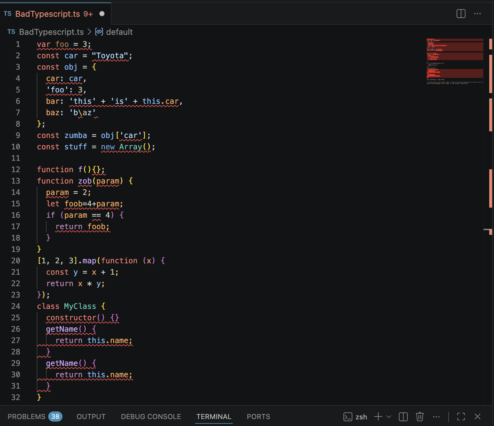

## The Most Important Software Engineering Technique

It's been a little over a week with ESLint, and while I can't say im not annoyed at having to follow these guidelines, they are definitely useful. If you told me I could only adopt a single software engineering practice for the rest of my career however, I would still choose testing. Tests catch bugs, bugs are bad, it makes you run your code, so you understand what you are writing, and what parts work, and what parts don't. Easy choice in my mind, I can however see the case that coding standards deserve that spot instead.

Coding standards are useful because they intervene earlier, at the moment of writing, and because of that they have a strong effect, code that follows a consistent standard is easier to review, because a reviewer isn't burning attention on randomly formatted and hard to read code. It's easier to test, because consistent naming and structure make it obvious what anything is supposed to do before you've read the implementation. It's also easier to onboard new teammates onto, because they're learning one set of conventions instead of reverse-engineering the (maybe multiple) authors' personal intents stitched together in one repository. All that being said, I don't think coding standards beat testing on their own merits. A standard won't catch a logic bug a test would catch. What I think instead is that standards are infrastructure that helps you do the other techniques, such as testing. 

## A Week Inside ESLint

Earlier this week was my first introduction to ESLint, after installing it on VSCode and doing the assignment, the first error I ever encountered on it was this:

```
console.log("Hello Typescript"); Strings must use single quotes.
```
I realized then that I will be seeing a bunch of red error squiggles as I code with it this semester. Obviously I found it quite annoying, to me, I don't really see the difference between using single quotes and double quotes for strings, or having an extra line at the end of every file else you get caught with an error. The same trait that makes it nitpicky though is the same trait that makes it useful. After using it for a few assignments, I realized how it will catch some unused variables, formatting errors, and other various issues even later on. It helps you expedite the most boring part of debugging, and that's helpful. 

So I've landed somewhere in the middle. Obviously a coding standard doesn't actually know the difference between "this is going to break something" and "this just looks bad aesthetically" - it just fires an error whenever a rule matches. Most of the time I think the errors are redundant, but because it's caught stuff I would've missed, I think it's useful at minimum. 

## Coding Standards and Languages

Honestly, I don't think the rule does a great amount of teaching, I think the burden falls on mostly the user, like when someone actually stop to look up why a flag exists instead of just clicking the auto-fix and moving on. Most of the time, I didn't do that. Part of that is because I already understand the language (Typescript in this case), however, even if I didn't, I don't think I would learn any especially better if I was forced to follow these style guidelines to a T. Granted, this is for ES Lint specifically. 

Overall, ESLint is something I appreciate, but often times I still find quite painful. Having Coding Standards is definitely helpful, I just think less strict and rigid rules might work better for me personally. 
