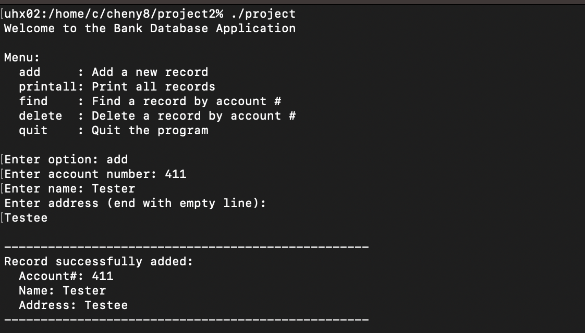

  

This Bank Database Application (C & C++) is a command-line program I built that functions as a simple bank record management system, entirely using a text editor with no help from an IDE. The application allows users to add, find, delete, and print customer records, each containing an account number, name, and address through an interactive text menu. All records are stored in a sorted linked list in memory and automatically saved to and loaded from a file between sessions, so data persists across runs.

This project was instructed to be built during ICS 212, and it was instructed to be built in two phases. The first version was written entirely in C, which required me to manage memory manually using malloc and free, implement pointer-based linked list operations, and handle file I/O with attention to formatting edge cases. The second version was a port of the same program to C++, where I reorganized the code to take advantage of object-oriented principles and C++ conventions. Writing the same logic twice in two different languages gave me a much deeper understanding of how the two languages relate to each other and where C++ abstracts away complexity that C forces you to handle explicitly.

As the project had strict requirements, there were many challenging aspects, such as implementing the debug mode, a command-line flag that, when passed, prints detailed diagnostic output for every function call including parameter values and memory addresses. This taught me how to think about program state at a low level and how to build observability into a system from the start, a habit that carries over into any kind of software development. Overall this project gave me a strong foundation in systems programming, data structures, and the fundamentals of how programs manage memory. At an overall level, this project was the culmination of the C and C++ Knowledge I learnt during the class. 

You can see the codebase for this project at the [Github page](https://github.com/YuxiangChen13/Projects).
