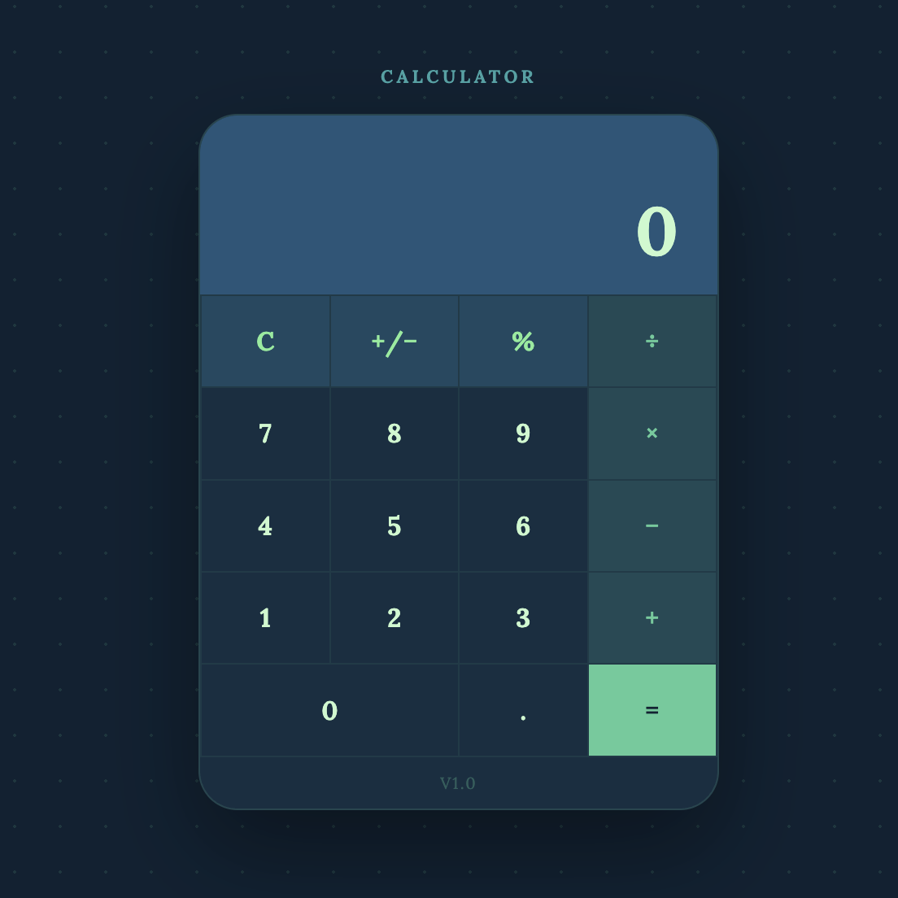

  

This Calculator is a web based math calculator I designed and built using HTML, CSS, and JavaScript. The app supports all four basic operations. Addition, subtraction, multiplication, and division along with percentage calculations, positive/negative toggling, and a live expression display that shows the full equation as numbers are entered. It also handles edge cases like divide-by-zero.

This was a solo project, built a few months after my [Habit Planner](https://yuxiangchen13.github.io/projects/HabitPlanner.html) app. Having already gone through the process of building a web app once, I came into this one with a different idea. Making the Habit Planner taught me the fundamentals, and I wanted to make the Calculator to think more carefully about application state and logic. At any moment the app has to track the current number, a stored number, and a pending operator simultaneously, and making those interact correctly when chaining multiple operations was the most technically demanding part of the project.

What I learned most from this project was the difference between something that works and something that feels complete. The calculator was fully functional already, but I added full keyboard support so users can type directly instead of clicking, and I wrote deliberate error handling for edge cases. These weren't necessary, but if they were not implemented, the app would feel less polished. The shift in thinking from "does it run" to "is it good" is probably the most valuable thing I took away from this project.

You can see the codebase for this project at the [Github page](https://github.com/YuxiangChen13/Calculator), As well as the actual app [here](https://yuxiangchen13.github.io/Calculator/).
