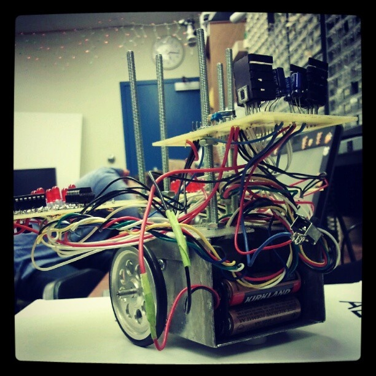
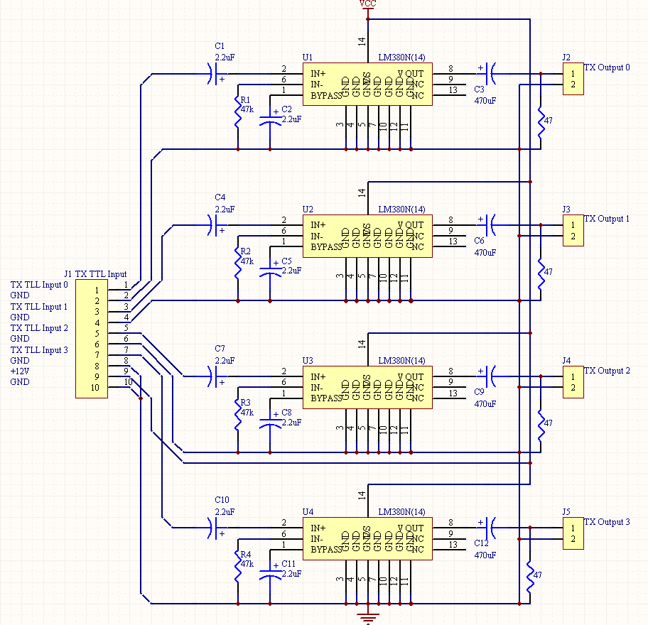

  
  
  

Habit Planner is a productivity web app I designed and built entirely using HTML, CSS, and JavaScript during my first year of University. The app allows users to list daily habits, track their completion over time, and monitor streaks and weekly progress. Everything runs locally in the browser, with data persisted through the browser's localStorage.

This project was my first experience building a functional, albeit easy web application from the ground up. I made all of the design decisions myself. From choosing the color palette to structuring the JavaScript logic for streak calculation and date tracking. Working through challenges like event delegation, DOM manipulation, and state management gave me a much stronger foundation in how the web actually works at a fundamental level.

Deploying the project through GitHub Pages taught me the basics of site hosting. Beyond the technical skills, this project helped me understand what it means to think like a developer, first understanding and breaking a problem into smaller pieces, then debugging unexpected behavior, and finally iterating on a design until it feels polished.

You can see the codebase for this project at the [Github page](https://github.com/YuxiangChen13/Habit-Planner).
